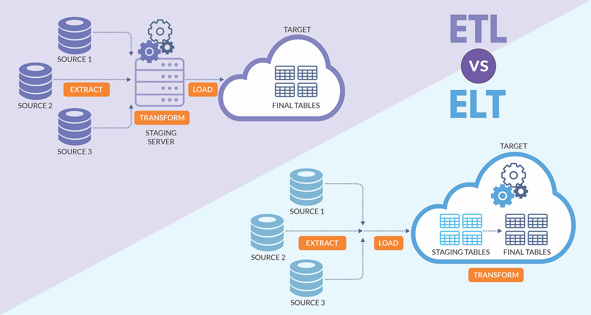

# An Introduction to Dataflow with Apache Nifi

## Intro to Data Flow and Data Pipelines

### Overview

What is dataflow?
- At a high level, dataflow is simply the automated and managed flow of information between systems  

#### ETL vs. ELT

ETL(extract, transform, load)  
- Data is retrieved from source and data is transformed before being loaded to its final target.  

ELT(extract, load, transform)  
- Data is retrieved and placed in its destination before procssing/transformations take place

## Apache NiFi

- NiFi is a framework for moving things from A to B where A and B can be almost anything including HTTP, FTP, HDFS, streaming, etc.
- Due to its extensible nature, NiFi can be configured to do almost anything, but, it is better considered as an ELT vs an ETL.
    - It is not the best tool for heavy processing such as complex joins or windowing aggregations.
- NiFi DOES have processors for light/simple transforms for tasks like data cleaning, filtering, etc.

### NiFi Extended Ecosystem
    
- NiFi Registery: Flow versioning and sharing tool
- MiNiFi: NiFi subproject with a lighweight footprint designed to live directly at the source of data creation
- NiFi C2 Server: Command and control. Provides orchestration for MiNiFi agents
- NiFi Fluid Design System: an atomic reusable platform for providing a consistent set of UI/UX components

### History

Devoloped by the US NSA starting around 2006 and open sourced to apache community in 2014

 > Project NiFi set out to address what were understood to be 'critical gaps' in traditional systems where other solutions lacked:  
    - sufficient security,  
    - interactivity,  
    - scalability and,  
    - data lineage/provenance i.e. a data life-cycle measure detailing data's origins & why, how and where it moves over a period of time.

> [NSA 'NiFi' Big Data Automation Project Out In The Open](https://www.forbes.com/sites/adrianbridgwater/2015/07/21/nsa-nifi-big-data-automation-project-out-in-the-open/)

### Key Features

#### Security

- allows for fine-grained security control
- various levels of security including:
   - system to system
   - User to system
   - multi-tenant

#### Ease of Use

- Guaranteed Delivery
- Web-based low/no code interface
- cli tools/Rest API
- Data Provenance

#### Extensible

- components are customizable and easy to load in
- because of the way NiFi implements its component system, the added components  can be built with little concern over conflicts with another extension

#### Scalable Flow Management

- Scale out with clustering
   - create a cluster
   - add more nodes to cluster
   - connect clusters
- Scale-up and down by tuning the flows
   - Buffering and Back Pressure/Release (settings configured in connection)
   - Prioritized Queuing
   - Flow Specific QoS
   
### Architecture

#### Web Server

Web-based user interface for building flows

#### Flow Controller

The brains of the operation
- Processor
- Extensions

#### Storage

- FlowFile Repository: stores the metadata of the file
- Content Repository: stores the payload (file content)
- Provenance Repository: stores the data provenance for the flow file

#### Clustering

> Starting with the NiFi 1.0 release, a Zero-Leader Clustering paradigm is employed. Each node in a NiFi cluster performs the same tasks on the data, but each operates on a different set of data. Apache ZooKeeper elects a single node as the Cluster Coordinator, and failover is handled automatically by ZooKeeper. All cluster nodes report heartbeat and status information to the Cluster Coordinator. The Cluster Coordinator is responsible for disconnecting and connecting nodes. Additionally, every cluster has one Primary Node, also elected by ZooKeeper. As a DataFlow manager, you can interact with the NiFi cluster through the user interface (UI) of any node. Any change you make is replicated to all nodes in the cluster, allowing for multiple entry points.

[nifi-overview](https://nifi.apache.org/docs/nifi-docs/html/overview.html#nifi-architecture)

### Core Concepts

#### FlowFile

- Attributes: metadata about the file
- payload: content of file

#### FlowFile Processor

- single unit of work in the NiFi system. different processors for different tasks

#### Connection

- link FlowFile processors
- back pressure

#### Process Group

- provides organization for processors in a data flow
- can be layered
- should be the defualt development canvas

###### Resources

[Apache NiFi Overview](https://nifi.apache.org/docs/nifi-docs/html/overview.html#nifi-architecture)  
[Everything Apache NiFi Gihub Repo](https://github.com/tspannhw/EverythingApacheNiFi?tab=readme-ov-file)  
[NiFi Contact Information](https://nifi.apache.org/community/contact/)
