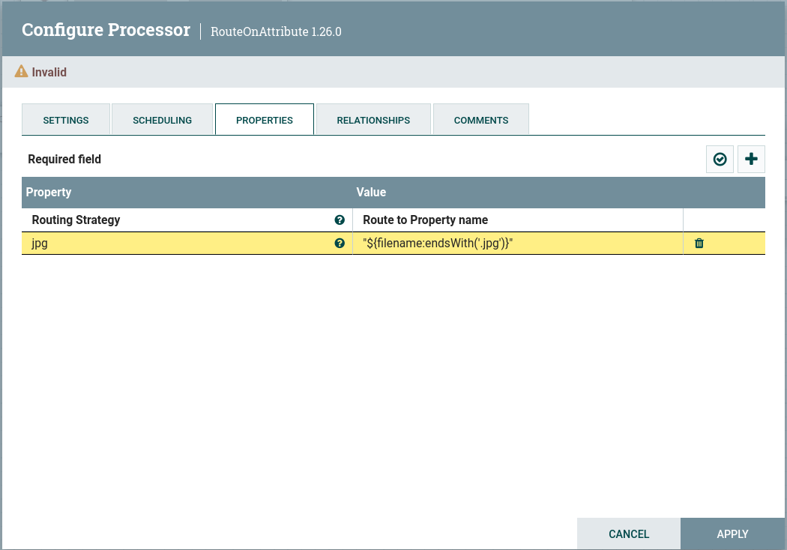
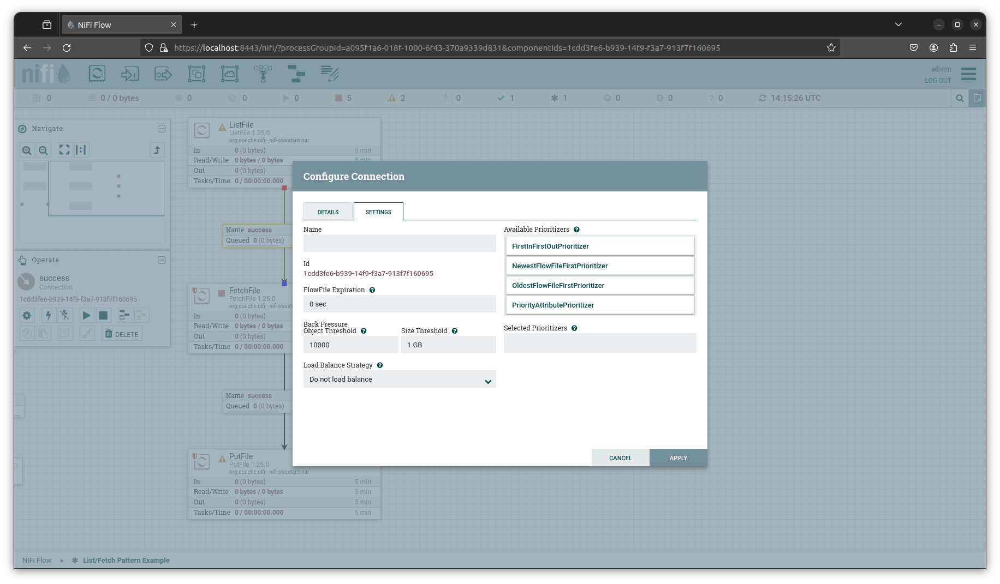

# NiFi usages

The NiFi UI provides an intuitive and easy to use interface for building dataflows.  

## User Interface

**Components Bar:** The components used in building flows. Hovering over a component on the toolbar displays its name.  
**Global Menu:** Contains options for manipulating the existing components on the canvas. Additionally selecting the Help option pulls up documentation for the current version of NiFi.  
**Status Bar:** Provides Global Flow information like number of threads in use, size of data, processor/component info, etc.  
**Navigate Pallette:** Provides convenient ways to navigate the flow such as zooming.  
**Operate Pallette:** Provides information about the currently selected component.  

<figure>

<figcaption>NiFi User Interface</figcaption>
</figure> 

## NiFi Component Overview
 
- **Input Port:** Pipes FlowFiles into process group.  
- **Output Port:** Pipes FlowFiles out of process group.  
- **Remote Process Group:** Treats external NiFi clusters as just another process group.  
- **Template:** An alternative method for sharing flows. It has been removed as of Nifi 2.0 and is not recommended for use in older versions of NiFi if NiFi Registry is available.  
- **Labels:** Used to provide quick flow documentation.  
- **Process Groups:** Used to logically organize flows. Flows are versioned/shared at the Process Group level. 
- **Processors:** The Processor is the most commonly used component, as it is responsible for data ingress, egress, routing, and manipulating. 

## Processor configuration

**Settings:** Provides options for naming the processor. 

- **Penalty Duration:** FlowFile level. An amount of time added to the FlowFile that indicates how long to pause the processing of that FlowFile after a problem has been encountered.
- **Yield Duration:** Processor level. The amount of time a processor will pause execution if problem is encounterd
- **Bulletin level:** This setting indicates the lowest level of Bulletin that should be shown in the User Interface. By default, the Bulletin level is set to WARN, which means it will display all warning and error-level bulletins.

**Scheduling:**

- **Scheduling strategy:** Timer or CRON Job. Simple timer is default. CRON job provides more control at the expense of complexity for configuration
- **Concurrent Tasks:** Essentially number of FlowFiles processed at the same time. Increases resource use by a given processor. 
- **Run Durration:** How long a processor runs before passing FlowFiles to next destination. Dial to control latency vs. throughput.

**Properties:**

This is the section for configuring processor specific behavior and will vary from processor to processor. There are a couple of features that may be encountered when configuring the properties of a processor that are worth noting:

- **Controller Service(s):** these provide processor group level ways of handling various files. An example might be a combo of Read/Write processors. The Read processor is configured to read a specific file format such as json. The write processor is configured to output the data in a specified format. So one could use the processor to Read a file in json and output the file in csv, Avero, Orc, etc.
- **NiFi Expression Language:** The [NiFi Expression Language](https://nifi.apache.org/docs/nifi-docs/html/expression-language-guide.html) provides a NiFi specific way for working with and manipulating FlowFile Attributes. For example, we could use the expression `"${filename:endsWith('.jpg')}"
` with a RouteOnAttribute processor to route all .jpg files in the flow.

<figure>

<figcaption>RouteOnAttribute .jpg example</figcaption>
</figure>

**Relationships:**

Relationships are the different output states for processor.  

- **terminate:** FlowFile is removed from flow and processing is considered complete
- **retry:** configurable with number of attempts and amount of time between each attempt before routing file forward

Note that if a relationship is auto terminate and retry, the retry cycle will complete before the process is auto-terminated.

**Comments:** Communicate with future you, admins, and/or other developers.

## Connection configuration

**Details:** General information about the relationship.  
**Settings:**  
- **FlowFile Expiration:** data can be aged out of the flow. Defualt value of 0 means the file never expires
- **Available Prioritizers:** Defaults to OldestFlowFileFirst (oldest in dataflow)
- **Back Pressure:** Provides both object and total size thresholds
- **Load Balance:** Used in clusters  

<figure>

<figcaption>NiFi Connection Configuration</figcaption>
</figure> 
